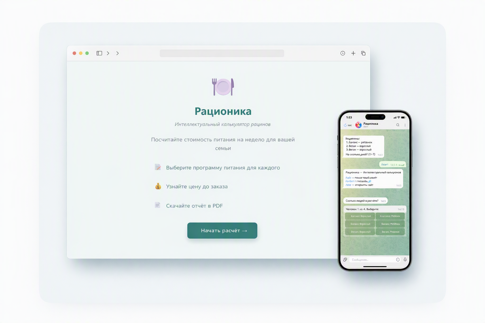

# Рационика — Интеллектуальный калькулятор рационов



Сервис для расчёта стоимости недельного рациона питания по Excel-меню. Поддерживает несколько людей с разными программами (Классика, Баланс, Веган), автоматический расчёт скидок и формирование заказов.

## Живое демо

- **Сайт:** [racionika.netlify.app](https://racionika.netlify.app)
- **Telegram-бот:** [@RacionikaBot](https://t.me/RacionikaBot)

## Возможности

- Загрузка меню из Excel (.xlsx) с валидацией
- Пошаговый расчёт рационов для нескольких людей
- 3 программы: Классика, Баланс, Веган
- Учёт взрослых и детей (ребёнок = 0.5 порции)
- Скидка 10% при заказе на 7 дней
- Генерация PDF-отчётов
- Публикация результатов по ссылке (share)
- Telegram-бот для расчёта и оформления заказов
- Админ-панель для управления меню и просмотра заказов

## Структура проекта

```
backend/         — FastAPI (Python), REST API
frontend/        — SPA (HTML/CSS/JS + Vite)
bot/             — Telegram-бот (python-telegram-bot)
sample_data/     — Пример меню (sample_menu_ru_headers.xlsx)
storage/         — Данные (меню, заказы, результаты)
run.py           — Менеджер сервисов (запуск + авто-restart)
```

## Быстрый старт

### Требования

- Python 3.11+
- Node.js 18+
- Telegram Bot Token (от [@BotFather](https://t.me/BotFather))

### Установка

```bash
git clone https://github.com/USERNAME/racionika.git
cd racionika

# Backend
pip install -r backend/requirements.txt

# Frontend
cd frontend && npm install && cd ..

# Bot
pip install -r bot/requirements.txt
```

### Настройка

```bash
# Backend
cp backend/.env.example backend/.env
# Отредактируйте backend/.env:
#   ADMIN_PASSWORD=ваш_пароль

# Bot
cp bot/.env.example bot/.env
# Отредактируйте bot/.env:
#   TELEGRAM_BOT_TOKEN=ваш_токен
```

### Запуск (все сервисы)

```bash
python run.py
```

Менеджер запустит backend (порт 8000), bot и frontend (порт 3000). Если какой-то сервис упадёт — он перезапустится автоматически.

### Запуск по отдельности

```bash
# Backend
uvicorn backend.main:app --host 0.0.0.0 --port 8000

# Bot
python -X utf8 bot/main.py

# Frontend (dev)
cd frontend && npm run dev
```

## API

| Метод | Путь | Описание |
|-------|------|----------|
| GET | `/api/health` | Проверка здоровья |
| GET | `/api/latest-menu` | Актуальное меню |
| POST | `/api/upload-menu` | Загрузка .xlsx |
| POST | `/api/calc` | Расчёт (POST body) |
| GET | `/api/calc` | Расчёт (query params) |
| POST | `/api/orders` | Создание заказа |
| GET | `/api/orders` | Список заказов |
| PATCH | `/api/orders/{id}` | Обновление статуса |
| GET | `/api/share/{token}` | Публичный результат |
| POST | `/api/generate-pdf` | Генерация PDF |

## Деплой на Netlify

Frontend деплоится на Netlify как статический SPA.

1. Загрузите файлы `frontend/` в репозиторий
2. В Netlify: New site from Git → выберите репозиторий
3. Build settings:
   - **Base directory:** `frontend`
   - **Build command:** `npm run build`
   - **Publish directory:** `dist`
4. В файле `netlify.toml` настройте редиректы для SPA

## Лицензия

MIT
